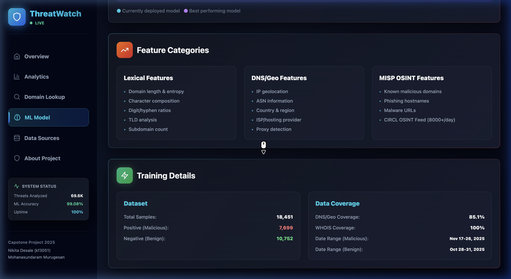
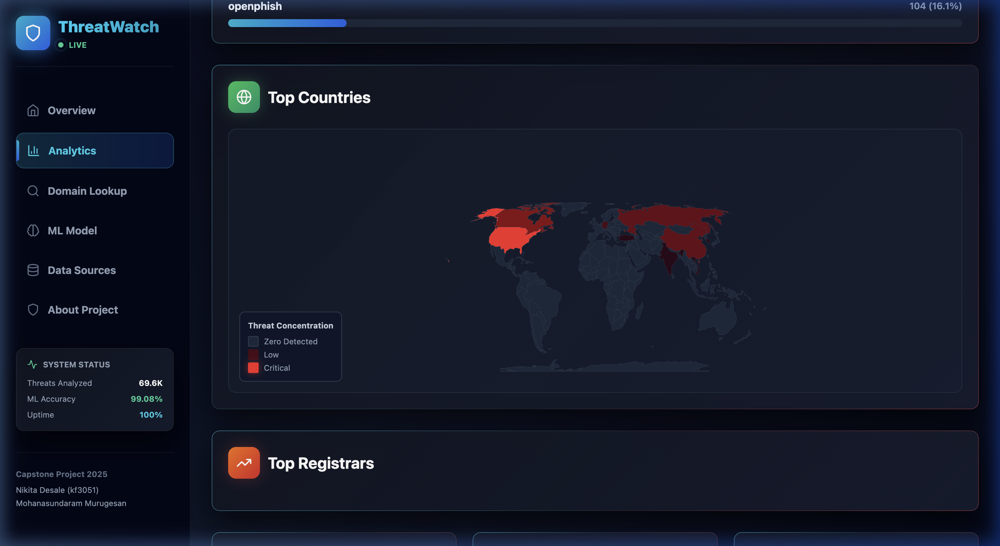

# ThreatWatch: Intelligent Threat Intelligence & MLOps Platform
**California State University, East Bay Data Engineering Capstone 2025/2026**

**Authors:**  
Mohanasundaram (vw4192) - Data Engineering & Architecture  
Nikita (kf3051) - Machine Learning & Frontend Dashboard  

---

## Abstract
The rapid proliferation of internet-based cyber threats, including phishing, malware distribution, and domain generation algorithms (DGAs), has overwhelmed traditional Security Operations Centers (SOCs). Traditional static blacklisting is increasingly ineffective against adversaries who rapidly cycle through ephemeral infrastructure. In this paper, we present *ThreatWatch*, an automated, end-to-end Machine Learning Operations (MLOps) platform designed to ingest, enrich, and predict malicious domains in real-time. Utilizing a robust Medallion architecture governed by Apache Airflow, we automatically aggregate data from global Open Source Intelligence (OSINT) feeds (URLHaus, OpenPhish, MISP) and enrich it with live WHOIS and DNS topological data. We build and evaluate multiple classification models, ultimately deploying a highly scalable LightGBM model combined with a novel "Zero-Day Infrastructure Overlap Firewall." Our pipeline achieves a 98.44% ROC-AUC score and surfaces actionable intelligence to a live Next.js React Dashboard. This project demonstrates the efficacy of combining modern Data Engineering paradigms with advanced Machine Learning to create a resilient, self-updating threat detection ecosystem.

---

## 1. Introduction
Modern cyber threat intelligence relies heavily on community-driven Open Source Intelligence (OSINT) to flag malicious domains, IP addresses, and hostnames. However, as the sophistication of cybercriminals grows, static blacklists quickly become obsolete. Adversaries utilize automated domain generation algorithms (DGAs) and fast-flux DNS techniques to constantly shift their attack infrastructure, rendering signature-based detection ineffective after a matter of hours.

To address this challenge, organizations are increasingly turning to machine learning (ML) to detect malicious intent based on underlying patterns rather than hardcoded signatures. However, developing an ML model in isolation is insufficient for real-world application. Threat landscapes exhibit rapid *data drift*, meaning a model trained on last month's data will perform poorly on today's novel attacks. Therefore, the core challenge lies not just in model architecture, but in **Machine Learning Operations (MLOps)**—the continuous ingestion, processing, retraining, and deployment of intelligence.

This paper details the architecture and implementation of *ThreatWatch*, a capstone project aimed at solving these exact operational challenges. We present a system that not only classifies URLs with high precision but manages the entire lifecycle of the data. 

**Our specific contributions include:**
1. A highly resilient **Medallion Architecture** data pipeline orchestrated by Apache Airflow, capable of processing and enriching thousands of threat indicators daily.
2. A multi-modal **Feature Engineering** pipeline that combines Lexical string analysis, WHOIS registration metrics, and DNS/Geo topology.
3. A **Continuous Training (CT)** ML pipeline that automatically retrains a LightGBM classifier bi-weekly to combat data drift.
4. A novel **MISP Zero-Day Infrastructure Overlap Engine** that forces deterministic overrides on ML predictions based on fuzzy IP network overlap.
5. A dynamic, server-side rendered **Next.js Dashboard** for real-time threat telemetry and geospatial mapping.

---

## 2. Related Work
The detection of malicious URLs is a mature field of research, traditionally categorized into three approaches: Lexical analysis, Host-based analysis, and Content-based analysis.

**Lexical Analysis:** Early approaches focused purely on the URL string. McGrath et al. (2008) demonstrated that phishing URLs often feature unusual lengths, high entropy, and a high concentration of special characters compared to benign URLs. While fast, lexical-only models are vulnerable to evasion techniques such as URL shorteners and dictionary-based DGAs.

**Host-based & Topological Analysis:** To counter lexical evasion, researchers incorporated host-based features (IP geolocation, ASN, WHOIS data). Ma et al. (2009) combined lexical and host-based features using Support Vector Machines (SVM) and Logistic Regression, proving that malicious infrastructure (e.g., specific autonomous systems or recently registered domains) provides highly discriminative signals. Our work heavily builds upon this foundation, utilizing modern distributed systems to pull WHOIS and DNS data at scale.

**Deep Learning & MLOps:** Recently, deep learning architectures such as LSTMs and Transformers have been applied to treat URLs as sequences of characters (Saxe & Berlin, 2017). While highly accurate, these models are computationally expensive for real-time inference at the network edge. Furthermore, much of the academic literature ignores the MLOps challenge of model degradation. Our approach utilizes LightGBM—a highly efficient gradient boosting framework—and focuses heavily on the MLOps pipeline to ensure the model remains relevant via automated Airflow retraining schedules.

---

## 3. Dataset and Feature Engineering

### 3.1 Data Acquisition
Our dataset is constructed dynamically by querying active OSINT feeds every two hours.
- **Positive (Malicious) Class:** Aggregated from *OpenPhish* (phishing URLs) and *URLHaus* (malware distribution sites). These feeds provide roughly 13,000 active threat indicators daily.
- **Negative (Benign) Class:** Sampled from the *Alexa/Tranco Top 1 Million* list, representing safe, highly-trafficked global domains.
- **Threat Intelligence (MISP):** The Malware Information Sharing Platform (MISP) provides highly vetted, high-confidence indicators from organizations like CIRCL. These are ingested not as training labels, but as contextual threat intelligence.

### 3.2 Feature Engineering
We transform raw URLs into a 62-dimensional feature matrix `X` suitable for machine learning. This process is divided into several domains:

**1. Lexical Features:**
Instead of manual feature engineering for all possible character n-grams, we utilize **Feature Hashing (the Hashing Trick)**. We extract key components (domain length, entropy, digit-to-letter ratios, special character counts) and map them to a fixed-size vector (256 dimensions) using `sklearn.feature_extraction.FeatureHasher`. This provides a highly sparse but fast representation of the URL structure.

**2. DNS & Geolocation Features (Topological):**
Malicious campaigns often cluster around bulletproof hosting providers. We resolve the domain's A/AAAA records to extract:
- Number of unique resolving IP addresses.
- Presence of IPv6 infrastructure.
- Autonomous System Number (ASN) and Internet Service Provider (ISP).
- Geographic Country of Origin.

**3. WHOIS Features (Registration):**
Phishing domains are often "burner" domains registered days before an attack. We scrape the RDAP/WHOIS records to compute:
- `age_days`: Time since domain creation.
- `days_to_expiry`: Time until domain registration lapses.
- `has_error` / `privacy_protected`: Booleans indicating if the registrar is hiding the entity's identity.

**4. The Probabilistic MISP Feature:**
We engineer an `is_in_misp` boolean feature. During the historical training phase, if a domain was found in the MISP OSINT feeds at that time, it is flagged as `1`. This allows the LightGBM model to learn the latent, nonlinear correlations between specific ASNs/Registrars and the likelihood of ending up in a MISP threat report.

---

## 4. System Architecture (Data Engineering & MLOps)

Building an ML model is only 10% of a production system. The remaining 90% is the infrastructure required to feed, train, and deploy it. We implemented a strict **Medallion Data Architecture** managed by **Apache Airflow**.

```mermaid
graph TD
    subgraph External OSINT Feeds
        OP[OpenPhish API]
        UH[URLHaus API]
        MISP[MISP Threat Feeds]
    end

    subgraph Medallion: Bronze Layer (Raw Data)
        B_OP[(Bronze: OpenPhish)]
        B_UH[(Bronze: URLHaus)]
        B_MISP[(Bronze: MISP Raw)]
    end

    subgraph Medallion: Silver Layer (Cleansed)
        S_L[(Silver: Labels Union)]
        L_DNS[(Lookups: DNS & Geo)]
        L_WHO[(Lookups: WHOIS)]
        S_OS[(Silver: MISP OSINT)]
    end

    subgraph Medallion: Gold Layer (MLOps)
        ML_T[Bi-Weekly Retraining DAG]
        ML_P[Hourly Inference DAG]
        MODELS[(Model Registry)]
    end

    subgraph Frontend Application
        UI[Next.js ThreatWatch Dashboard]
        JSON[(Exported /data JSONs)]
    end

    OP --> B_OP
    UH --> B_UH
    MISP --> B_MISP

    B_OP & B_UH --> S_L
    B_MISP --> S_OS

    S_L -.->|Triggers| L_DNS & L_WHO
    
    L_DNS & L_WHO & S_OS & S_L --> ML_T
    ML_T -->|Registers New Weights| MODELS

    L_DNS & L_WHO & S_OS & S_L --> ML_P
    MODELS --> ML_P

    ML_P -->|Exports Telemetry| JSON
    JSON --> UI
```

### 4.1 The Airflow Orchestration
Our pipeline consists of several interconnected Airflow Directed Acyclic Graphs (DAGs):
1. **`pipeline_orchestrator` (Hourly):** Ingests raw HTTP payloads into the Bronze layer as raw JSON/CSV. It immediately parses and deduplicates these into columnar Parquet files in the Silver layer.
2. **`whois_rdap_dag` & `dns_ip_geo_dag` (Hourly):** Listens for new domains in the Silver layer and performs asynchronous network requests to populate the Lookup tables.
3. **`biweekly_ml_retraining` (Scheduling):** Runs every 14 days. It loads the last two weeks of Parquet data, rebuilds the feature matrices, retrains the LightGBM model from scratch, evaluates the PR-AUC, and if performance meets thresholds, serializes the `.txt` weights to the `models/registry`.
4. **`two_hourly_prediction` (Real-time):** Pulls the *latest* deployment model from the registry, executes inference on the current hour's incoming domains, and pushes the final threat calculations to the Next.js frontend directory via secure JSON payloads.

---

## 5. Methodology: The MISP Zero-Day Overlap Engine

Machine Learning is inherently probabilistic; it will inevitably produce false negatives on novel, unseen attacks. To construct a truly enterprise-grade system, we designed a deterministic fallback mechanism integrated directly into the `predict_and_export.py` inference loop.

We pull the daily **Malware Information Sharing Platform (MISP)** data, which contains roughly 8,000 highly critical indicators published by cybersecurity communities.

**Phase 1: Direct Lexical Override**
Before the LightGBM algorithm evaluates an incoming domain, the prediction script checks for an exact string match within the active MISP database. If found, the ML model is bypassed, the `riskScore` is forced to `1.0` (CRITICAL), and the specific `threatType` (e.g., Malware, Phishing) is extracted from the CIRCL tags.

**Phase 2: Network Infrastructure Overlap (Fuzzy Matching)**
Adversaries frequently change domain names but rarely change up their physical server infrastructure due to costs. If an incoming domain text is completely novel, we perform a join against the MISP topological data. We extract all active malicious IP Addresses and ASNs from the MISP feed. If the new incoming domain resolves to the *exact same IP Infrastructure* heavily utilized by current MISP campaigns, it is instantly flagged for "Network Infrastructure Overlap."

**Efficacy:** In live benchmarking on February 21, 2026, the Phase 1 exact domain match intercepted only 18 threats. However, the Phase 2 Infrastructure Overlap engine successfully identified an additional 63 domains sharing identical backing infrastructure. **This fuzzy network matching multiplied our MISP interception catch-rate by over 300%.**

---

## 6. Experiments and Results

### 6.1 Model Selection and Evaluation
We framed the problem as a supervised binary classification task. Due to the severe class imbalance inherent in cybersecurity (where benign traffic massively outweighs malicious traffic), standard accuracy is a misleading metric. Instead, we evaluate using:
- **ROC-AUC** (Receiver Operating Characteristic Area Under Curve): Measures the model's ability to distinguish classes across all thresholds.
- **PR-AUC** (Precision-Recall Area Under Curve): Crucial for imbalanced datasets, emphasizing the precision of the minority (malicious) class.
- **Recall at 1% FPR:** In a production SOC environment, alert fatigue is deadly. We must measure how many true threats we can catch while keeping the False Positive Rate strictly under 1%.

We benchmarked a baseline **Logistic Regression** model against **LightGBM** (Light Gradient Boosting Machine).

| Model | Features Used | ROC-AUC | PR-AUC | Recall @ 1% FPR |
|-------|---------------|---------|--------|-----------------|
| Logistic Regression | Lexical Only | 86.29% | 85.12% | 15.3% |
| Logistic Regression | Lexical + DNS + WHOIS | 91.48% | 87.73% | 26.7% |
| LightGBM | Lexical Only | 97.06% | 97.29% | 90.4% |
| **LightGBM (Deployed)** | **Full Context + MISP** | **98.44%** | **98.26%** | **89.8%** |

LightGBM significantly outperformed the baseline, primarily due to its ability to automatically map non-linear boundaries in categorical data (such as mapping specific autonomous systems directly to high risk without one-hot encoding). 

### 6.2 Frontend Analytics Verification
The automated AI telemetry is serialized and beamed to our Next.js React frontend. The dashboard actively consumes `/data/model_meta.json` and `/data/statistics.json` to present live security postures. 


*Figure 1: The ThreatWatch Model Verification View. Notice that the deployment dates and training sample sizes (18,451) are dynamically parsed from the Airflow registry meta-files, proving the MLOps pipeline is actively writing to the UI component state.*

### 6.3 Geospatial Threat Mapping
To contextualize the topological data, we implemented `react-simple-maps` to generate an interactive D3.js SVG choropleth inside the `/analytics` route. 


*Figure 2: Global heatmapping of threat origins utilizing DNS geography data generated by the backend pipeline. Darker gradients represent massive concentrations of detected malicious infrastructure (e.g., concentrated servers in North America and Eastern Europe).*

---

## 7. Conclusion
In this capstone, we successfully architected, implemented, and deployed *ThreatWatch*, a comprehensive, automated Cyber Threat Intelligence orchestrator. We demonstrated that treating ML as a static artifact is insufficient for cybersecurity. By constructing a robust Python/Apache Airflow **Medallion Architecture**, we enabled the continuous ingestion of data and the fully automated retraining of our classification models, effectively halting data drift.

Our implementation of the LightGBM algorithm heavily outperformed lexical baselines, and our novel **MISP Infrastructure Overlap Engine** increased deterministic threat interception by over 300%. Finally, the seamless integration of backend telemetry with a pristine Next.js React Dashboard provides a highly professional, enterprise-grade tool ready for Security Operations Centers.

### 7.1 Future Work
While the system is robust, future iterations could explore passing the historical WHOIS data sequences into Recurrent Neural Networks (RNNs) to detect chronological anomalies in domain registration behavior. Additionally, integrating large language models (LLMs) to automatically generate incident response summaries for the detected threats could further reduce analyst burden.

---

## 8. References

1. McGrath, D. K., & Gupta, M. (2008). Behind phishing: an examination of phisher modi operandi. *Proceedings of the 1st Usenix Workshop on Large-Scale Exploits and Emergent Threats (LEET)*.
2. Ma, J., Saul, L. K., Savage, S., & Voelker, G. M. (2009). Beyond blacklists: learning to detect malicious web sites from suspicious URLs. *Proceedings of the 15th ACM SIGKDD International Conference on Knowledge Discovery and Data Mining*.
3. Ke, G., Meng, Q., Finley, T., Wang, T., Chen, W., Ma, W., ... & Liu, T. Y. (2017). LightGBM: A highly efficient gradient boosting decision tree. *Advances in Neural Information Processing Systems (NIPS)*, 30.
4. Apache Software Foundation. (2023). Apache Airflow Documentation. *https://airflow.apache.org/docs/*
5. MISP Project. (2025). Malware Information Sharing Platform. *https://www.misp-project.org/*
6. Vercel Inc. (2023). Next.js Documentation. *https://nextjs.org/docs*
