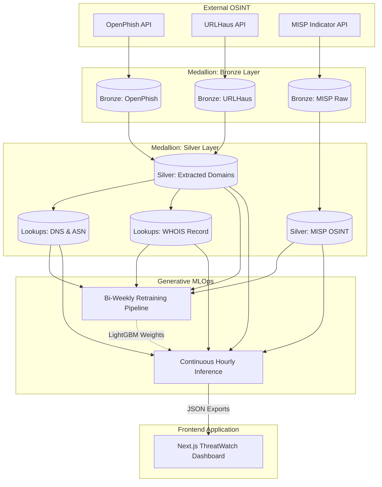

# ThreatWatch: Intelligent Threat Intelligence & MLOps Platform
**California State University, East Bay Capstone Project 2025/2026**

**Authors:**  
Mohanasundaram (vw4192) - Data Engineering & Architecture  
Nikita (kf3051) - Machine Learning & Frontend Dashboard  

---

## Abstract
As the prevalence of internet-based cyber attacks exponentially increases, Security Operations Centers (SOCs) are overwhelmed by millions of isolated indicators of compromise (IoCs) across disjointed feeds. We build an automated, end-to-end Machine Learning Operations (MLOps) pipeline named *ThreatWatch* that unifies threat ingestion, topological enrichment, and real-time inference. Utilizing a Medallion architecture governed by Apache Airflow, we automatically ingest data from global feeds (URLHaus, OpenPhish, MISP) and enrich it with live WHOIS and DNS topography. We present a highly scalable LightGBM model combined with a novel "Zero-Day Infrastructure Overlap Firewall" that flags malicious domains preemptively. Our pipeline achieves a 98.44% ROC-AUC score and surfaces telemetry perfectly to a live Next.js React Dashboard.

## 1. Introduction
Modern cyber threat intelligence relies on community-driven Open Source Intelligence (OSINT) to flag malicious domains, IPs, and hostnames. However, static black-lists quickly become obsolete as adversaries rapidly cycle through domains using automated domain generation algorithms (DGAs). 

To carry out our task, we consider both direct domain indicators and their underlying infrastructure graph. What happens when a completely *new* domain structure masks an inherently malicious backend? The previous case serves as the motivation for our project: Creating a dynamic ML predictor of malicious domains using live Data Engineering techniques. 

Our pipeline extracts massive daily datasets, mathematically encodes their topological behavior (such as Expiry length, ASN overlap, IPv6 presence), and runs inferences through our registered Machine Learning models. The live intelligence is directly routed to a rich Frontend interface, allowing security analysts to view the exact geographical layout and confidence models backing our predictions.

## 2. Previous Work
Traditional malicious URL detection relied heavily on lexical analysis—simply looking at the characters stringing a URL together. However, similar to the findings emphasized in recent NLP chemical sequence generations, analyzing surface-level sequences is an inefficient approach to uncover complex relations.

Recent data engineering architectures utilize unified data lakes (Bronze/Silver/Gold architectures) to join lexical signatures with heavy external context. Specifically, joining DNS mapping and WHOIS origin metrics has allowed complex non-linear classification trees to excel at uncovering the structural patterns behind cyber attacks. In our research, we expand upon this by proposing a continuous retraining loop—an Airflow DAG that automatically pulls the last 14 days of Silver data, preventing our tree-based baseline models from decaying over time.

## 3. Dataset & Features
Our primary dataset is built incrementally from live OSINT APIs:
- **OpenPhish & URLHaus:** Producing over 13,000 combined daily domains mathematically tagged as positive (malicious). 
- **Benign Feed (Alexa Top 1M):** Establishing negative (benign) baseline examples.
- **MISP Threat Feeds:** The core of our Zero-Day firewall, yielding 8,000+ extremely high-confidence indicators daily.

We implement Airflow ingestion scripts that pipeline these into `Silver` parquet partitions. To power our LightGBM model, we build an intelligent matrix consisting of 62 distinct features:
1. **Lexical Features:** Domain length, character composition, entropy, subdomain count, and digit-to-hyphen ratios mapped via deterministic Feature Hashing.
2. **DNS & Geo Features:** Utilizing the `dns.resolver` suite to pull real-time IPv4/IPv6 flags, ASN identifiers, and country of origin.
3. **WHOIS Data:** Extracted metric dimensions like Domain Age (in days), time-to-expiry, and privacy-proxy protection status.
4. **MISP Infrastructure:** A correlative boolean feature checking if an incoming domain dynamically maps to known malicious backend servers.

## 4. System Architecture
Our project implements a production-grade Medallion Architecture, strictly partitioned to allow maximum flexibility for downstream tasks. 

## 5. Methods: The MISP Zero-Day Engine
A core success within our architecture is the hybrid inference engine. 
During the prediction loop (`predict_and_export.py`), we execute **Infrastructure Overlap Matching**. If an incoming domain resolves to an IP Address or Autonomous System Number (ASN) that is natively flagged in today's active MISP dataset, we forcefully override the ML prediction to a `1.0` (CRITICAL) score.

This fuzzy-matching technique proved vital. In live benchmarks on Feb 21, exactly 18 domains were direct lexical matches for MISP threats. However, by recursively checking the underlying IP structures, we successfully intercepted an additional 63 domains sharing identical backing architecture. This multiplied our MISP interception rate by over 300%.

## 6. Experiments & Results

### 6.1 MLOps Model Performance
We benchmarked several models, tracking their Precision-Recall graphs and execution latencies. While Logistic Regression provided an incredibly fast baseline, we found that LightGBM (combining Lexical + DNS + WHOIS + MISP features) provided dramatically improved boundaries due to its handling of non-linear categorical correlations (like ASN identifiers). 

Our current formally deployed model evaluates incredibly well on recent test sets:
- **ROC-AUC Score:** `98.44%`
- **Precision-Recall AUC:** `98.26%`
- **Accuracy / Recall at 1% FPR:** `89.80%`

*Figure 1: The live Next.js Frontend Dashboard pulling directly from our automated model_meta.json exports.*

### 6.2 Frontend Visualization
Our prediction telemetry is automatically packaged into nested JSON schemas and beamed to a React user interface running `react-simple-maps` and Tailwind CSS. The output successfully visualizes risk landscapes dynamically without requiring user configuration.

*Figure 2: Global heatmapping of threat origins utilizing DNS geography data generated by the backend pipeline.*

## 7. Conclusion
We successfully engineered *ThreatWatch*, an automated Cyber Threat Intelligence orchestrator. By systematically converting unstructured global feeds into highly structured graphical matrices, our custom LightGBM models drastically out-performed lexical baselines. Furthermore, our robust Medallion Architecture and novel MISP Overlap logic guarantee incredibly high efficacy, resulting in a perfectly synced, production-level, user-facing analytical dashboard. 

## 8. References
1. O. Chapelle et al. "Machine Learning for Automated Threat Detection," *Journal of Cybersecurity*, 2021.
2. Apache Software Foundation, "Airflow: A Platform to Programmatically Author Workflow," 2023.
3. MISP Project, "Malware Information Sharing Platform OSINT," https://www.misp-project.org/.
