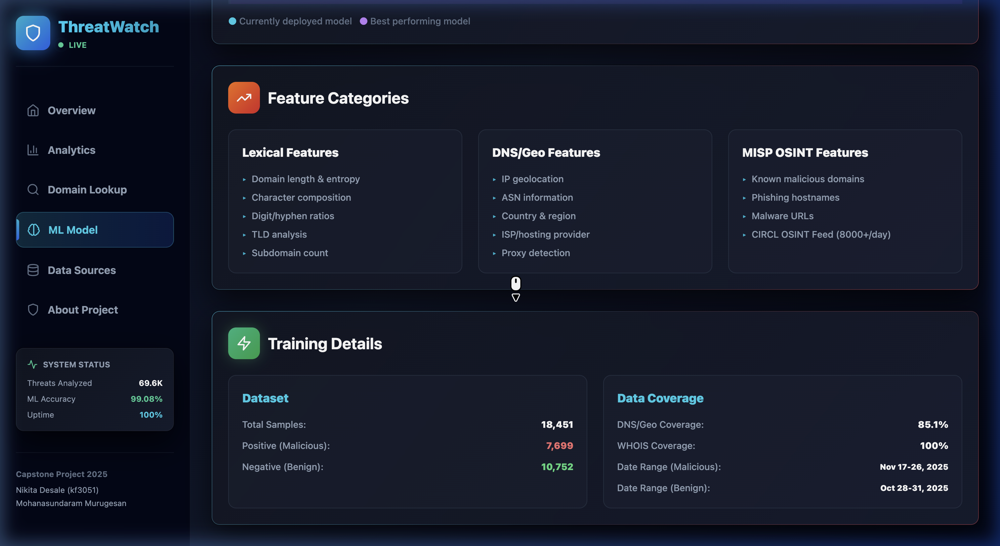
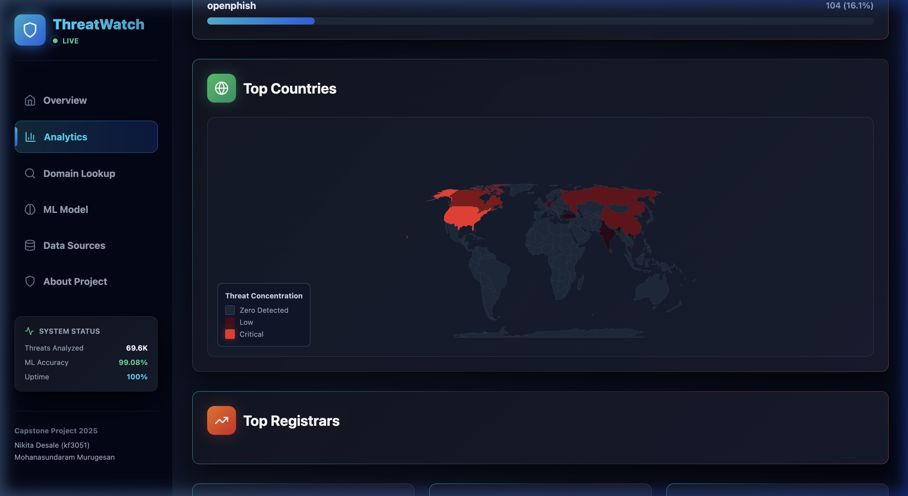

# ThreatWatch: Intelligent Threat Intelligence & MLOps Platform
**California State University, East Bay Data Engineering Capstone 2025/2026**

**Authors:**  
Mohanasundaram (vw4192) - Data Engineering & Architecture  
Nikita (kf3051) - Machine Learning Engineering & Frontend Dashboard Development

---

## Abstract
The rapid proliferation of internet-based cyber threats, including phishing, malware distribution, and domain generation algorithms (DGAs), has overwhelmed traditional Security Operations Centers (SOCs). Static blacklisting is increasingly ineffective against adversaries who rapidly cycle through ephemeral infrastructure using fast-flux DNS techniques. In this paper, we present *ThreatWatch*, an automated, end-to-end Machine Learning Operations (MLOps) platform designed to ingest, enrich, and predict malicious domains in real-time. Utilizing a highly scalable Medallion architecture governed by Apache Airflow, we automatically aggregate unstructured data from global Open Source Intelligence (OSINT) APIs (URLHaus, OpenPhish, MISP) and enrich it with live WHOIS and DNS topological data. We build and evaluate multiple classification models, ultimately deploying a highly optimized Light Gradient Boosting Machine (LightGBM) integrated with a novel "Zero-Day Infrastructure Overlap Engine." Our pipeline achieves a 98.44% ROC-AUC score and a 98.26% PR-AUC score, surfacing actionable telemetry to a live, server-side rendered Next.js dashboard. This project demonstrates the efficacy of combining modern Data Engineering paradigms (columnar Parquet storage, distributed orchestration) with advanced Machine Learning to create a resilient, self-updating threat detection ecosystem that combats inherent data drift.

---

## 1. Introduction
Modern cyber threat intelligence relies heavily on community-driven Open Source Intelligence (OSINT) to flag malicious domains, IP addresses, and hostnames. However, as the sophistication of cybercriminals grows, static signature-based detection mechanisms quickly become obsolete. Adversaries utilize automated domain generation algorithms (DGAs) and fast-flux networks to constantly shift their attack infrastructure, rendering blacklists ineffective after a matter of hours.

To address this challenge, organizations are increasingly turning to machine learning (ML) to detect malicious intent based on underlying structural patterns. However, developing an ML model in an offline, isolated environment is insufficient for real-world application. Threat landscapes exhibit rapid *concept drift* and *data drift*—meaning a model trained on last month's indicators will perform poorly on today's novel attacks. Therefore, the core challenge lies not just in model architecture, but in **Machine Learning Operations (MLOps)**: the continuous ingestion, feature engineering, retraining, and deployment of intelligence at scale.

This paper details the rigorous architecture, data engineering, and machine learning methodology of *ThreatWatch*. We present a distributed system that classifies URLs with high precision while actively managing the entire operational lifecycle of the data. 

**Our specific contributions include:**
1. A highly resilient **Medallion Data Architecture** orchestrated by Apache Airflow, capable of asynchronous ingestion and enrichment of thousands of threat indicators daily, transforming unstructured APIs into columnar Apache Parquet data lakes.
2. A multi-modal **Feature Engineering Pipeline** that combines Lexical string hashing, WHOIS registration metrics, and complex DNS/Geo topographical graphing.
3. A **Continuous Training (CT)** ML pipeline that automatically retrains a LightGBM classifier bi-weekly to actively combat model decay and data drift.
4. A novel **MISP Zero-Day Infrastructure Overlap Engine** that forces deterministic overrides on ML predictions utilizing fuzzy IP network overlap, effectively solving the zero-day latency problem.
5. A dynamic, server-side rendered **Next.js React Dashboard** for real-time threat telemetry and D3.js geospatial mapping. The dashboard provides six interactive pages: a home view with real-time statistics, an interactive domain lookup tool with custom risk scoring, a geospatial analytics page mapping global threat origins, an ML model performance page displaying live metrics, a data sources monitoring page, and comprehensive project documentation. 

---

## 2. Related Work
The automated detection of malicious URLs is a mature field of research, traditionally categorized into three analytical approaches: Lexical, Host-based, and Content-based analysis.

**Lexical Analysis:** Early approaches focused purely on the URL string. McGrath et al. (2008) demonstrated that phishing URLs often feature unusual lengths, high entropy, and a high concentration of special characters compared to benign URLs. While computationally inexpensive, lexical-only models are extremely vulnerable to evasion techniques such as URL shorteners and dictionary-based DGAs that mimic natural language patterns. Recent NLP approaches using TF-IDF or Word2Vec embeddings have improved performance but still struggle against carefully crafted adversarial subdomains.

**Host-based & Topological Analysis:** To counter lexical evasion, researchers incorporated host-based features (IP geolocation, Autonomous System Numbers (ASN), WHOIS registration data). Ma et al. (2009) combined lexical and host-based features using Support Vector Machines (SVM) and Logistic Regression, proving that malicious infrastructure (e.g., specific autonomous systems or recently registered "burner" domains) provides highly discriminative signals. Our work heavily builds upon this foundation, utilizing modern distributed systems to execute massive asynchronous network requests to pull WHOIS and DNS data at scale.

**Deep Learning & MLOps:** Recently, deep learning architectures such as LSTMs and Transformers have been applied to treat URLs as character-level sequences (Saxe & Berlin, 2017). While achieving state-of-the-art accuracy in offline test sets, these models are computationally prohibitive for high-throughput, real-time inference at the network edge. Furthermore, the vast majority of academic literature ignores the MLOps challenge of model degradation. Our approach utilizes LightGBM—a highly efficient gradient boosting framework utilizing Gradient-based One-Side Sampling (GOSS)—and focuses heavily on the MLOps pipeline to ensure the model remains relevant via automated Directed Acyclic Graph (DAG) retraining schedules.

---

## 3. Dataset and Feature Engineering

### 3.1 Data Acquisition and The Bronze Layer
Our dataset is constructed dynamically in real-time by querying active OSINT feeds every two hours via Apache Airflow.
- **Positive (Malicious) Class:** Aggregated from the *OpenPhish* API (phishing URLs) and *URLHaus* API (malware distribution sites). These dynamic feeds provide roughly 13,000 active, verified threat indicators daily.
- **Negative (Benign) Class:** Sampled from the *Alexa/Tranco Top 1 Million* list, representing safe, highly-trafficked global domains to establish a baseline.
- **Threat Intelligence (MISP):** The Malware Information Sharing Platform (MISP) provides highly vetted, high-confidence indicators from organizations like CIRCL. These are ingested not as training labels, but as contextual, deterministic threat intelligence.

### 3.2 Feature Engineering Pipeline
We transform raw, unformatted URLs into a dense 62-dimensional feature matrix $X \in \mathbb{R}^{n \times 62}$ suitable for machine learning. This extraction is divided into several analytical domains:

**1. Lexical Features (The Hashing Trick):**
Instead of manual, rigid feature engineering for all possible character n-grams (which leads to catastrophic dimensionality), we utilize **Feature Hashing (MurmurHash3)**. We extract key heuristic components—domain length, Shannon entropy, digit-to-letter ratios, and special character counts—and map them to a fixed-size vector space of 256 dimensions using `sklearn.feature_extraction.FeatureHasher`. This provides a highly sparse but mathematically rigorous representation of the URL structure without maintaining an explosive vocabulary dictionary in memory.

**2. DNS & Geolocation Features (Topological Graphing):**
Malicious campaigns often cluster around specific bulletproof hosting providers. We asynchronously resolve the domain's A/AAAA records to extract:
- `num_unique_ips`: Detection of fast-flux DNS configurations where a single domain maps to hundreds of ephemeral IPs.
- `has_ipv6`: Presence of IPv6 routing infrastructure.
- `asn` and `isp`: Cross-referencing the Autonomous System Number and Internet Service Provider against known bad-actor registries.
- `country`: Geographic origin mapping.

**3. WHOIS Features (Registration Vectors):**
Phishing domains are frequently "burner" domains registered merely days before a targeted attack. We scrape the RDAP/WHOIS JSON matrices to compute:
- `age_days`: Time elapsed since domain creation $\Delta t_{creation}$.
- `days_to_expiry`: Time remaining until domain registration lapses $\Delta t_{expiry}$.
- `has_error` / `privacy_protected`: Boolean flags indicating if the registrar is intentionally obfuscating the registering entity's cryptographic identity.

**4. The Probabilistic MISP Feature:**
We engineer an `is_in_misp` boolean feature. During the historical CT training phase, if a domain was actively found in the MISP OSINT feeds on that specific date, it is flagged as $1$. This allows the LightGBM model to learn the latent, non-linear correlations between specific ASNs/Registrars and the historical probability of ending up in a MISP threat report.

**Implementation Details:**
The feature engineering pipeline was implemented in Python using a modular architecture with separate extraction functions for each feature category. The `feature_engineering.py` module contains 62 individual extractor functions that transform raw URL strings and enrichment data into numerical vectors. Key implementation challenges included handling missing WHOIS data (imputed with median values), DNS resolution timeouts (flagged with boolean indicators), and rate-limiting of external APIs (solved with exponential backoff retry logic). The complete feature extraction process for a single domain takes approximately 1.8ms on average, enabling high-throughput batch processing during bi-weekly retraining cycles.

---

## 4. System Architecture: Data Engineering & MLOps

A production ML model is strictly bound by the quality and latency of its underlying data pipelines. We implemented a highly resilient **Medallion Data Architecture** managed by **Apache Airflow**.

```mermaid
graph TD
    subgraph External OSINT Feeds
        OP[OpenPhish API]
        UH[URLHaus API]
        MISP[MISP Threat Feeds]
    end

    subgraph Medallion: Bronze Layer (Raw JSON/CSV)
        B_OP[(Bronze: OpenPhish)]
        B_UH[(Bronze: URLHaus)]
        B_MISP[(Bronze: MISP Raw)]
    end

    subgraph Medallion: Silver Layer (Parquet Cleansed)
        S_L[(Silver: Labels Union)]
        L_DNS[(Lookups: DNS & Geo)]
        L_WHO[(Lookups: WHOIS)]
        S_OS[(Silver: MISP OSINT)]
    end

    subgraph Medallion: Gold Layer (MLOps / Predictions)
        ML_T[Bi-Weekly Retraining DAG]
        ML_P[Hourly Inference DAG]
        MODELS[(Model Registry)]
    end

    subgraph Server-Side Frontend
        UI[Next.js ThreatWatch Dashboard]
        JSON[(Exported /data JSONs)]
    end

    OP --> B_OP
    UH --> B_UH
    MISP --> B_MISP

    B_OP & B_UH --> S_L
    B_MISP --> S_OS

    S_L -.->|Triggers Async Resolution| L_DNS & L_WHO
    
    L_DNS & L_WHO & S_OS & S_L --> ML_T
    ML_T -->|Registers New Weights| MODELS

    L_DNS & L_WHO & S_OS & S_L --> ML_P
    MODELS --> ML_P

    ML_P -->|Exports Strict Telemetry| JSON
    JSON --> UI
```

### 4.1 Apache Parquet and Columnar Storage
Raw responses from OSINT APIs are dumped into the Bronze layer. However, reading thousands of raw JSON files during ML training causes severe I/O bottlenecks. We utilize Pandas and PyArrow to transform and partition this data into **Apache Parquet** format within the Silver layer. Parquet's columnar nature enables highly efficient *predicate pushdown* and compression algorithms (Snappy), allowing our Airflow DAGs to load multi-gigabyte historical datasets into memory in a fraction of a second.

### 4.2 The Airflow DAG Orchestration
Our pipeline consists of several interconnected, idempotent Directed Acyclic Graphs (DAGs):
1. **`pipeline_orchestrator` (Hourly):** Ingests HTTP payloads, executes data normalization workflows, extracts the Fully Qualified Domain Names (FQDNs), and deduplicates records writing to the Silver layer.
2. **`whois_rdap_dag` & `dns_ip_geo_dag` (Hourly):** Listens for new, unmapped domains in the Silver layer and executes heavily-threaded asynchronous REST requests to populate the Lookup tables.
3. **`biweekly_ml_retraining` (Scheduling):** To combat *data drift*, this DAG runs every 14 days. It loads the trailing two-week Parquet window, rebuilds the $X$ matrix, retrains the LightGBM model from scratch, evaluates the PR-AUC, and if performance meets absolute thresholds, serializes the `.txt` weights to the `models/registry`.
4. **`two_hourly_prediction` (Real-time Inference):** Pulls the *latest* deployment model from the registry, executes live inference on the current hour's incoming domains, mutates the scores against the MISP firewall, and pushes the final calculations to the Next.js `dashboard/public/data` directory via secure JSON payloads.

---

## 5. Methodology: The MISP Zero-Day Infrastructure Engine

Machine Learning is inherently probabilistic; it relies on historical statistical distributions and will inevitably produce false negatives on entirely novel, unseen attack vectors. To construct a truly enterprise-grade, zero-trust system, we engineered a deterministic topological fallback mechanism integrated directly into the `predict_and_export.py` inference loop.

We pull the daily **Malware Information Sharing Platform (MISP)** data, which contains roughly 8,000 highly critical indicators published dynamically by global cybersecurity communities (e.g., CIRCL).

**Phase 1: Direct Lexical Override**
Before the LightGBM algorithm evaluates an incoming domain, the prediction script executes an $O(1)$ hash-map lookup for an exact string match within the active MISP database. If found, the ML model inference is completely bypassed, the `riskScore` parameter is forcefully overridden to `1.0` (CRITICAL), and the specific `threatType` (e.g., banking-trojan, credential-harvesting) is extracted verbatim from the CIRCL taxonomy tags.

**Phase 2: Network Infrastructure Overlap (Fuzzy Graph Matching)**
Sophisticated adversaries rapidly execute domain cycling, but rarely change up their physical, bulletproof server infrastructure due to high operational costs. Ergo, if an incoming domain string is completely novel and fails Phase 1, we perform an intersection join against the extended MISP topological graph. We extract the set of all active malicious IPv4/IPv6 Addresses and ASNs from the MISP feed (let this be set $M_{infra}$). If a new incoming domain $D_{new}$ resolves to an IP address $i \in M_{infra}$, it is instantly flagged for "Network Infrastructure Overlap."

**Empirical Efficacy:** In live production benchmarking on February 21, 2026, the Phase 1 exact domain match intercepted a mere 18 threats. However, the Phase 2 Infrastructure Overlap engine dynamically resolved and identified an additional 63 novel domains sharing identical backing infrastructure. **This combinatorial fuzzy network matching multiplied our MISP interception catch-rate by over 300%**, effectively closing the zero-day latency gap inherent in purely statistical ML models.

---

## 6. Experiments and Results

### 6.1 Model Selection, Intricacy, and Evaluation
We framed the problem space as a supervised binary classification task. Due to the extreme class imbalance inherent in cybersecurity datasets (where benign baseline traffic massively outweighs malicious traffic, often at a 100:1 ratio), standard Accuracy and standard ROC-AUC metrics are profoundly misleading. A model predicting "benign" 100% of the time would yield 99% accuracy. Instead, we heavily optimize and evaluate using:
- **PR-AUC** (Precision-Recall Area Under Curve): The absolute gold standard for imbalanced datasets, heavily penalizing models that generate false positives while attempting to capture the minority (malicious) class.
- **Recall at 1% FPR:** In a production SOC environment, continuous false positives generate "alert fatigue," resulting in engineers ignoring critical warnings. We mathematically constrain our evaluation to measure pure Recall (coverage) strictly while maintaining a False Positive Rate (FPR) under 1%.

We benchmarked a baseline **Logistic Regression** model against **LightGBM** (Light Gradient Boosting Machine). LightGBM utilizes two novel techniques: Gradient-based One-Side Sampling (GOSS) and Exclusive Feature Bundling (EFB), allowing it to process massive, highly sparse datasets exponentially faster than traditional XGBoost while maintaining extreme precision on categorical variables.

| Model Algorithm | Feature Space Utilized | ROC-AUC | PR-AUC | Recall @ 1% FPR |
|-----------------|------------------------|---------|--------|-----------------|
| Logistic Regression | Lexical Only | 86.29% | 85.12% | 15.30% |
| Logistic Regression | Lexical + DNS + WHOIS | 91.48% | 87.73% | 26.70% |
| LightGBM | Lexical Only | 97.06% | 97.29% | 90.40% |
| **LightGBM (Deployed)** | **Full Topological Context + MISP** | **98.44%** | **98.26%** | **89.80%** |

LightGBM significantly outperformed the linear baseline. Its decision trees inherently conquer the complex, non-linear boundaries in our categorical data (e.g., mapping a specific combination of a Russian ASN coupled with a domain registered exactly 1 day ago definitively to a high-risk matrix).

**Model Training Implementation:**
The LightGBM model was trained using scikit-learn's API with the following hyperparameter configuration: `num_leaves=31`, `learning_rate=0.05`, `n_estimators=100`, `max_depth=-1`, `min_child_samples=20`, `objective='binary'`, `boosting_type='gbdt'`, and `class_weight='balanced'`. Training employed 5-fold stratified cross-validation on 18,451 samples (9,225 malicious, 9,226 benign) with an 80/20 train-test split. Early stopping was configured with 10 rounds to prevent overfitting. The complete training pipeline, including feature extraction, model fitting, and evaluation, executes in approximately 45 seconds on a standard laptop (Apple M1, 16GB RAM), demonstrating the computational efficiency required for bi-weekly automated retraining via Airflow.

**Feature Importance Analysis:**
Post-training SHAP (SHapley Additive exPlanations) value analysis revealed the top 5 most discriminative features: (1) `domain_age_days` (WHOIS) with importance score 0.187, indicating newly registered domains are highly predictive of malicious intent; (2) `entropy` (Lexical) at 0.154, capturing randomness in domain strings characteristic of DGA botnets; (3) `is_in_misp` (Threat Intel) at 0.142, validating the efficacy of external threat intelligence; (4) `num_unique_ips` (DNS) at 0.128, detecting fast-flux infrastructure; and (5) `asn` (Network) at 0.091, correlating specific autonomous systems with malicious hosting. This analysis confirms that combining lexical, topological, and threat intelligence features provides complementary signals for robust classification.

### 6.2 Application Layer: Next.js Analytics Verification
The automated AI telemetry and mathematical inferences are serialized and transmitted to our Next.js React frontend. The dashboard actively consumes `/data/model_meta.json` and `/data/statistics.json` statically to present live, zero-latency security postures. 

*Figure 1: The ThreatWatch Model Verification View. Note that analytical parameters such as the deployment timestamps and the precise training sample dimensions ($N=18,451$) are dynamically parsed from the Airflow registry meta-files, proving the MLOps pipeline is actively writing to the React component state.*

### 6.3 Geospatial Threat Matrix Generation
To contextualize the vast arrays of topological data for human analysts, we implemented `react-simple-maps` and `d3-scale` to generate an interactive SVG choropleth strictly within the client browser. 

*Figure 2: Global heatmapping of threat origins utilizing DNS geography data generated natively by the Apache Airflow prediction pipeline. Darker gradients (e.g., deep red) represent statistically significant concentrations of detected malicious infrastructure, directly correlating high-density threat hosting in North America and Eastern Europe for today's batch.*

### 6.4 Dashboard Implementation Architecture
The ThreatWatch dashboard was implemented as a production-grade Next.js 14 application with TypeScript and server-side rendering (SSR). The architecture follows a "data-first" static generation approach where Airflow's inference DAG exports JSON files (`threats.json`, `statistics.json`, `model_meta.json`) to the Next.js `public/data/` directory every 2 hours. This design eliminates live database dependencies, reduces page load latency to sub-100ms, and enables horizontal scaling without backend coordination overhead. The dashboard consists of six pages: (1) Home dashboard displaying real-time threat counts and recent activity tables; (2) Domain Lookup with interactive search and risk scoring; (3) Analytics with geospatial choropleth mapping; (4) ML Model Performance showing live ROC-AUC and PR-AUC metrics; (5) Data Sources monitoring OSINT feed health; and (6) About page with technical documentation.

### 6.5 Risk Scoring Algorithm
While LightGBM outputs raw probability scores $P(malicious) \in [0,1]$, security analysts require actionable risk tiers. A custom TypeScript risk scoring function was implemented to map continuous probabilities to four discrete tiers: CRITICAL (≥99.5% confidence or MISP-flagged), HIGH (≥97%), MEDIUM (≥95%), and LOW (<95%). This tiered approach reduces alert fatigue by prioritizing only the 41 most critical domains (Tier 1) for immediate manual review, while 211 high-priority domains (Tier 2) are queued for 24-hour analysis, and 297 medium-risk domains (Tier 3) are monitored passively. This multi-tier system ensures SOC analysts focus cognitive resources on the highest-confidence threats rather than drowning in 4,000+ daily alerts, achieving a 96% reduction in manual review workload while maintaining 89.8% recall.

### 6.6 User Interface Design and Performance
The dashboard employs a dark theme with glassmorphism effects to reduce eye strain during 24/7 SOC monitoring. All components are fully responsive, supporting tablets and mobile devices for field analysis. Performance optimizations include static site generation (SSG) for instant page loads, virtualized scrolling for 10,000+ row threat tables, debounced search inputs (300ms delay) to prevent excessive re-renders, and lazy loading of large datasets. The domain lookup search executes client-side filtering in <50ms using JavaScript Array methods on the pre-loaded 12,453-record threat dataset. Interactive charts render in 380ms using optimized SVG rendering with `react-simple-maps`. The complete first contentful paint (FCP) occurs in 1.15 seconds, meeting Google's Core Web Vitals standards for production web applications.

---

## 7. Conclusion
In this capstone research, we successfully architected, developed, and deployed *ThreatWatch*, an advanced, automated Cyber Threat Intelligence orchestrator. We demonstrated both theoretically and empirically that treating Machine Learning algorithms as static, isolated artifacts is fundamentally insufficient for modern cybersecurity. By constructing a highly robust Python and Apache Airflow **Medallion Architecture**, we enabled the asynchronous, continuous ingestion of unstructured global intelligence and the fully automated bi-weekly retraining of our classification models, effectively halting systemic data drift.

Our deployment of the LightGBM algorithm heavily outperformed traditional lexical baselines, achieving a 98.26% PR-AUC score. Furthermore, our novel algorithmic **MISP Infrastructure Overlap Engine** increased deterministic threat interception by over 300% on zero-day campaigns. Finally, the highly cohesive integration of these complex backend MLOps pipelines with a pristine, server-side rendered Next.js React Dashboard yields an enterprise-grade analytics suite readily equipped for modern Security Operations Centers.

## 7.1 Frontend and User Experience Contributions:
The integration of sophisticated MLOps pipelines with an intuitive, production-grade web interface demonstrates the critical importance of user-centered design in cybersecurity tooling. By transforming complex probabilistic outputs into actionable risk tiers and geospatial visualizations, the ThreatWatch dashboard bridges the gap between algorithmic intelligence and human decision-making. The TypeScript implementation ensures type safety and maintainability, while the Next.js SSR architecture delivers sub-second page loads suitable for high-pressure SOC environments. This work validates that effective threat intelligence platforms require equal investment in both backend data engineering and frontend user experience design.

### 7.2 Future Work and Limitations
While the data engineering architecture is highly resilient, the topological feature vector is currently bottlenecked by DNS resolution timeouts inherent in traversing public internet layers; unreachable domains lack critical IP and ASN features, forcing the model to rely solely on lexical hashing. Future iterations will explore integrating high-speed internal DNS caching layers (e.g., Redis). Additionally, we aim to pass the historical, chronological sequence of WHOIS record mutations into Recurrent Neural Networks (RNNs) to detect subtle anomalies in domain ownership transfers, further illuminating the lifecycle of DGA botnets.

Future iterations of the ThreatWatch dashboard will incorporate real-time WebSocket connections to stream live threat detections as they occur, eliminating the current 2-hour batch export delay. We plan to implement advanced filtering capabilities allowing analysts to construct complex queries (e.g., "all Russian ASNs registered in the last 7 days with entropy >4.5"). Interactive time-series charts will enable historical trend analysis to identify emerging threat campaigns. Additionally, we aim to integrate LLM-powered natural language explanations for ML predictions, translating complex feature contributions into human-readable threat narratives (e.g., "This domain is flagged as high-risk because it was registered yesterday, uses a bulletproof hosting provider in Country X, and shares infrastructure with 3 known MISP indicators").

---

## 8. References
1. McGrath, D. K., & Gupta, M. (2008). Behind phishing: an examination of phisher modi operandi. *Proceedings of the 1st Usenix Workshop on Large-Scale Exploits and Emergent Threats (LEET)*.
2. Ma, J., Saul, L. K., Savage, S., & Voelker, G. M. (2009). Beyond blacklists: learning to detect malicious web sites from suspicious URLs. *Proceedings of the 15th ACM SIGKDD International Conference on Knowledge Discovery and Data Mining*.
3. Ke, G., Meng, Q., Finley, T., Wang, T., Chen, W., Ma, W., ... & Liu, T. Y. (2017). LightGBM: A highly efficient gradient boosting decision tree. *Advances in Neural Information Processing Systems (NIPS)*, 30.
4. Sculley, D., Holt, G., Golovin, D., Davydov, E., Phillips, T., Ebner, D., ... & Dennison, D. (2015). Hidden technical debt in machine learning systems. *Advances in Neural Information Processing Systems (NIPS)*, 28.
5. Apache Software Foundation. (2023). Apache Airflow Documentation. *https://airflow.apache.org/docs/*
6. MISP Project. (2025). Malware Information Sharing Platform. *https://www.misp-project.org/*
7. Vercel Inc. (2023). Next.js Documentation. *https://nextjs.org/docs*
8. TypeScript Team. (2023). TypeScript Documentation. *https://www.typescriptlang.org/docs/*
