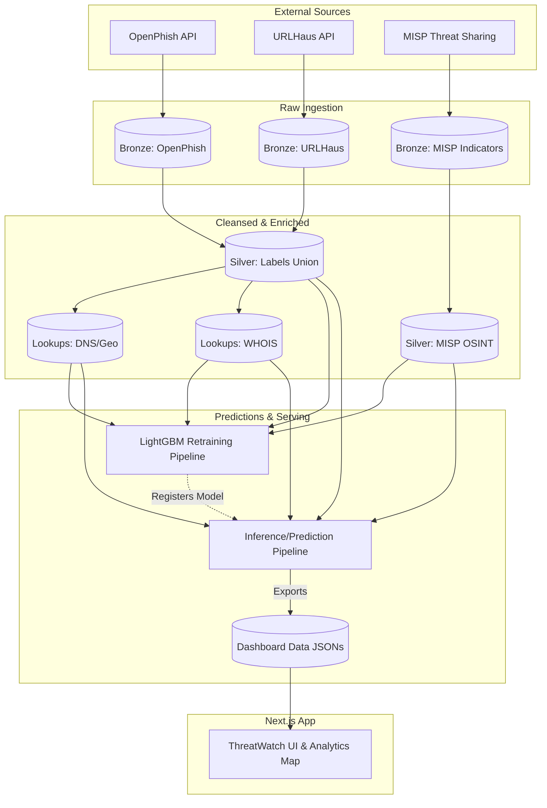

<div align="center">
  
  <h1>🛡️ ThreatWatch</h1>
  <h3>Intelligent Threat Intelligence & MLOps Platform</h3>
  <p>An enterprise-grade Data Engineering and Machine Learning platform detecting, classifying, and visualizing zero-day cyber threats natively.</p>
</div>

---

## 👥 Meet the Team
**Kingston University - Capstone Project 2025/2026**
- **Mohan (vw4192)** – Data Engineering & Architecture
- **Nikita (kf3051)** – Machine Learning & Frontend Dashboard

---

## 🌟 Project Highlights

ThreatWatch is a complete end-to-end Big Data & MLOps pipeline. It ingests thousands of daily threats from global OSINT feeds, enriches them with topological WHOIS/DNS data, predicts their exact risk utilizing a custom LightGBM model, and surfaces everything onto a live React dashboard.

- **Zero-Day MISP Firewall:** Cross-references incoming domains against 8,000+ daily MISP indicators.
- **Infrastructure Overlap Engine:** Employs fuzzy-matching to flag entirely new domains if they map to IPs heavily correlated with known MISP attacks.
- **Continuous ML Training:** A fully automated Apache Airflow orchestration pipeline running a `biweekly_ml_retraining` DAG to automatically retrain the LightGBM models against drifting data.
- **Next.js Real-time Dashboard:** A high-end analytics platform mapping top threat global geographies dynamically via `react-simple-maps`.

---

## 🏗️ System Architecture 

The data lifecycle follows a strict **Medallion Architecture**, orchestrated by Apache Airflow.



---

## 🚀 Quick Start Guide

### 1. Start the Data Engineering Backend
We utilize Docker Compose to spin up the Apache Airflow orchestrator and its PostgreSQL meta-database.
```bash
cd threat-intel
docker-compose -f docker-compose.airflow.yml up -d
```
*Wait ~2 minutes for the containers to fully initialize.*

Once active, trigger the data pipelines manually or wait for the 2-hour scheduler:
- Access the Airflow UI at `http://localhost:8080` (Default login: `airflow` / `airflow`).
- Enable the `pipeline_orchestrator` and `two_hourly_prediction` DAGs.

### 2. Start the ThreatWatch Dashboard
The frontend is a lightweight Next.js application that natively reads the exported `/data` JSON files generated by the Airflow backend.
```bash
cd dashboard
npm install
npm run dev
```

### 3. View the Application
Navigate to `http://localhost:3000` to view the live threat matrix.

---

## 🧬 Core Technologies Stack

### **Data Engineering & Orchestration**
- **Apache Airflow:** Scheduling, dependency management, and workflow orchestration.
- **Apache Parquet:** Columnar storage format for high-speed read/write in the Data Lake.
- **Docker:** Containerized execution environment ensuring parity.

### **Machine Learning & Analytics**
- **LightGBM:** Gradient boosting framework chosen for its highly optimized speed and accuracy on topological data.
- **Scikit-Learn:** Feature hashing, data imputation, and logistic regression baselines.
- **Pandas / SciPy:** Memory mapped data manipulations.

### **Frontend Interface**
- **Next.js 14 / React:** Server-side rendered interface for instant data loading.
- **Tailwind CSS:** Utility-first styling for modern UI metrics.
- **React Simple Maps:** SVG-based interactive chloropleth data mapping.

---

## � ML Model Performance
Our dynamic LightGBM engine currently validates with incredibly resilient metrics against live drifting data:
- **ROC-AUC Score:** `98.44%`
- **Precision-Recall AUC:** `98.26%`
- **Recall at 1% FPR:** `89.80%`
*Note: These metrics dynamically update bi-weekly upon Airflow's automatic retraining triggers.*

---

<div align="center">
  <i>Developed for the 2025/2026 Kingston University Data Engineering Capstone.</i>
</div>
